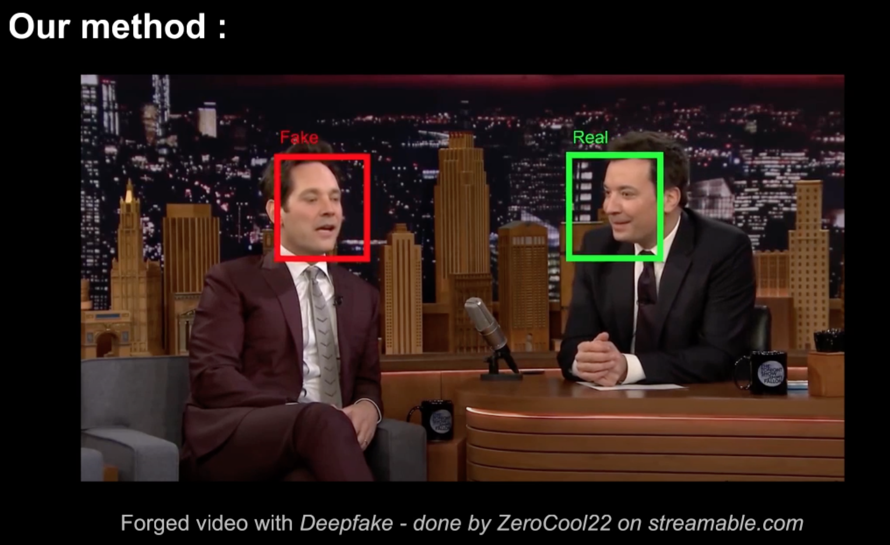
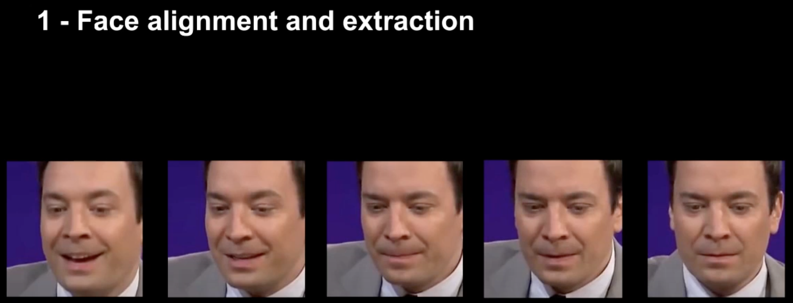
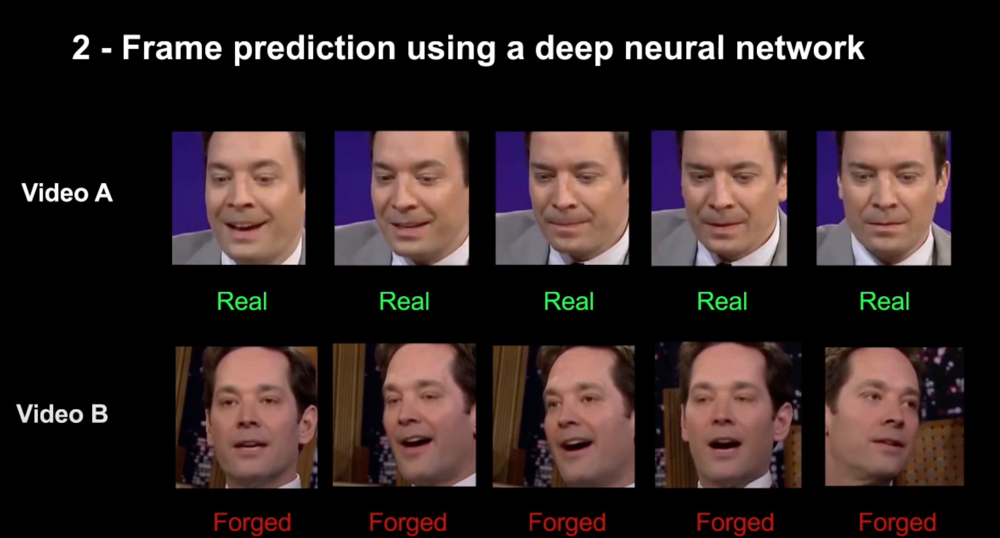

# Tensorflow-Deepfake-Detection-Mesonet
A Tensorflow Implementation of MesoNet: a Compact Facial Video Forgery Detection Network (https://arxiv.org/abs/1809.00888)

Here is Jimmy Fallon (Paul Rudd) on the The Jimmy Fallon Show. 



**STEPS :**





**REQUIREMENTS :**

Mesonet utilises Deepfake detection on Cropped Faces. For this a fast and accurate pytorch based tool is used to crop the faces. 

```
git clone https://github.com/elliottzheng/face-detection
```

**DATASET :**

We use the Deepfake Dataset DFDC available publicly at Facebook. (https://ai.facebook.com/datasets/dfdc/)

The dataset has videos and its labels reside in JSON format for each file. For parsing this information and placing videos in respective folders , after downloading the dataset run the command below :

 ```
python filter_videos.py
```


**TRAINING :**

```
python train.py \

```
**RESULTS :**


<!-- 


 -->
